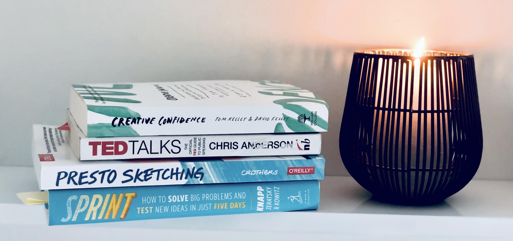

# Hey there 👋

# Check out the book reviews: 

* [Prepared: What Kids Need for a Fulfilled Life by Diane Tavenner](https://github.com/anastasiia-ku/anastasiia-ku.github.io/blob/master/prepared.md)

## Reading List 2020

### Product Management
* Design a Better Business: New Tools, Skills, and Mindset for Strategy and Innovation by Justin Lokitz, Lisa Kay Solomon, and Patrick Van Der Pijl
* Design Sprint by Jake Knapp

### Self Development
* Atomic Habits by James Clear
* TED Talks: The Official TED Guide to Public Speaking by Chris Anderson
* The Doodle Revolution: Unlock the Power to Think Differently by Sunni Brown

### Non-fiction

* The Book of Laughter and Forgetting by Milan Kundera
* A Clockwork Orange  by Anthony Burgess
* Zuleikha Opens Her Eyes by Guzel Yakhina
* A Room of One’s Own by Virginia Woolf
* The power of opposites by  Ichac Adizes
* An American Tragedy by Theodore Dreiser
* All the Light We Cannot See by Anthony Doerr

## 2020: Books I have read

### Product Management
* The Five Dysfunctions of a Team: A Leadership Fable by Patrick M. Lencioni

### Self Development
* Ikigai: The Japanese Secret to a Long and Happy Life by Albert Liebermann and Hector Garcia
* Make Time: How to focus on what matters every day by Jake Knapp
* Nonviolent Communication: A Language of Life: Life-Changing Tools for Healthy Relationships by Marshall B. Rosenberg
* Prepared: What Kids Need for a Fulfilled Life by Diane Tavenner

### Non-fiction
* Hunting and Gathering by Anna Gavalda
* The Kite Runner by Khaled Hosseini
* The Rosie Project  by Graeme Simsion

## 2019: Reading List

### Product Management

* Agile Product Management with Scrum: Creating Products that Customers Love by Roman Pichler
* Strategize: Product Strategy and Product Roadmap Practices for the Digital Age by Roman Pichler
* Visual Thinking: Empowering People and Organisations Through Visual Collaboration
Book by Willemien Brand
* Inspired: How to Create Tech Products Customers Love by Marty Cagan
* Shape Up : Stop Running in Circles and Ship Work that Matters by Ryan Singer
* The Culture Code: The Secrets of Highly Successful Groups by Daniel Coyle

### Non-fiction

* A Thousand Splendid Suns by Khaled Hosseini

## Books I Read Long Time Ago

1. Fountainhead by Ayn Rand
2. 💥 Atlas Shrugged by Ayn Rand
3. Gone with the wind  by Margaret Mitchell
4. Shantaram by Gregory David Roberts
5. Midnight’s Children  by Salman Rushdie
6. Extremely Loud & Incredibly Close by  Jonathan Safran Foer
7. Radical Candor: Be a Kick-Ass Boss Without Losing Your Humanity by Kim Scott
8. The Grapes of Wrath by John Steinbeck
9. Perfume: The Story of a Murderer by Patrick Süskind
10. Nineteen Eighty-Four by George Orwell
11. Brave New World by Aldous Huxley
12. We by Yevgeny Zamyatin
13. The Handmaid’s Tale by Margaret Atwood
14. Good Wives  by Louisa May Alcott
15. The Trial by Franz Kafka
16. The Picture of Dorian Gray by Oscar Wilde
17. The Shadow of the Wind  by Carlos Ruiz Zafón
18. To Kill a Mockingbird by Harper Lee
19. Beloved by Toni Morrison
20. The Master and Margarita by Mikhail Bulgakov
21. A Young Doctor’s Notebook by Mikhail Bulgakov
22. Tender is the Night by F. Scott Fitzgerald
23. Arch of Triumph by Erich Maria Remarque
24. Three Comrades by Erich Maria Remarque
25. Fahrenheit 451 by Ray Bradbury
26. Foundation by Aizek Azimov 
27. Flowers for Algernon by Daniel Keyes
28. The Minds of Billy Milligan by Daniel Keyes
29. The Book Thief by Markus Zusak
30. Pride and Prejudice by Jane Austen
31. Airport by Arthur Hailey
32. The Witches of Eastwick by John Updike
33. Influence: Science and Practice by Robert Cialdini
34. The Unbearable Lightness of Being by Milan Kundera
35. Norwegian Wood by Haruki Murakami
36. Inferno Novel by Dan Brown
37. The Empire of the Angels  by Bernard Werber
38. Nous les Dieux  by Bernard Werbe
